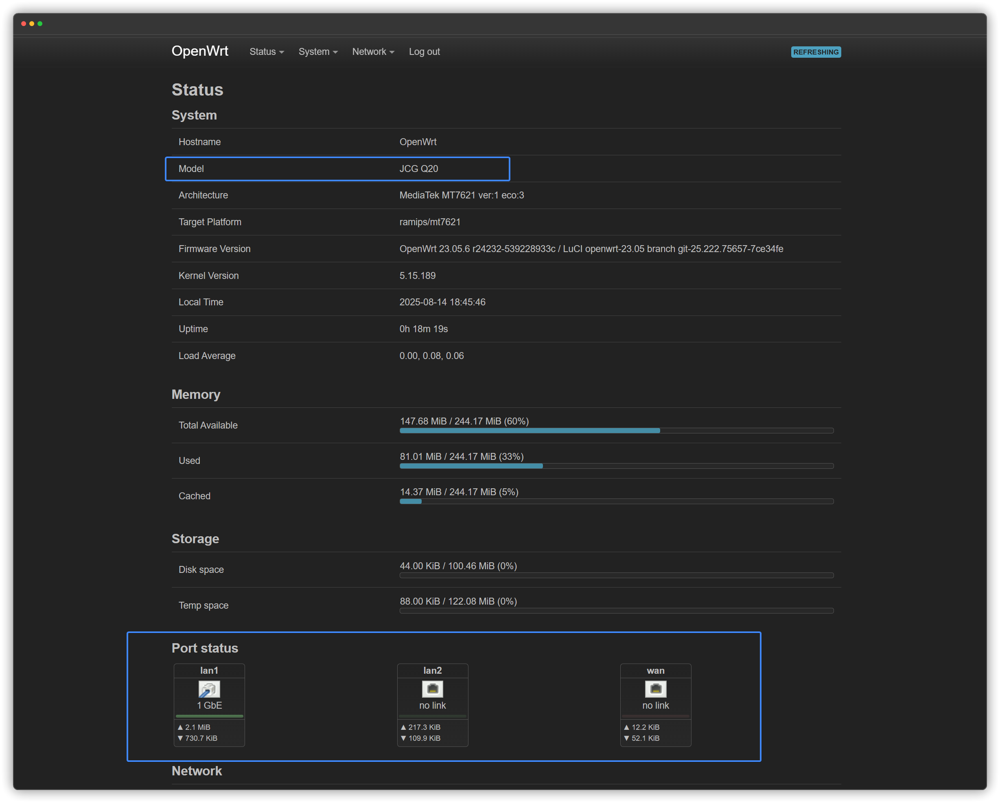
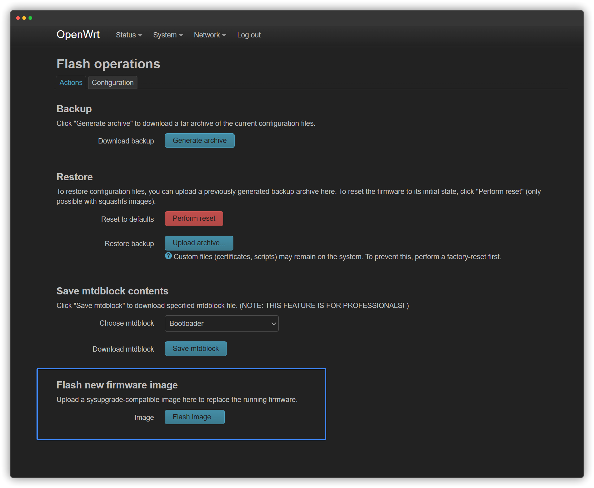
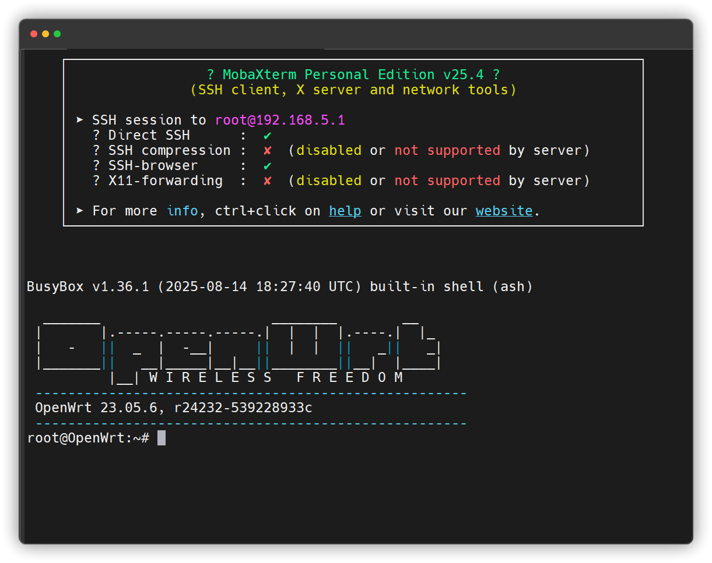
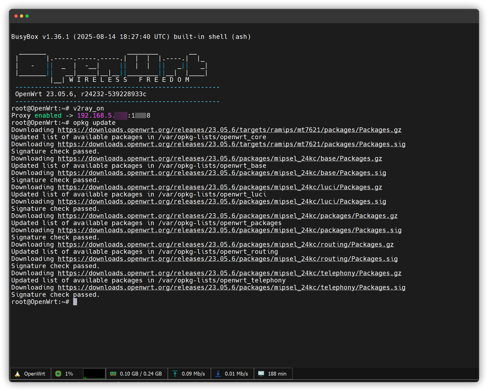

**English** | [中文](https://p3terx.com/archives/build-openwrt-with-github-actions.html)

# 编译的固件实测可用

- 设备型号：JCG Q20
- PB-boot：PandoraBox ([必须是Xiaomi CR660X版本](./src/img/2.png))
- 系统版本：OpenWrt 23.05.6
- 默认IP登录地址：192.168.5.1
- 官方源码底板：[xiaomi_mi-router-cr6606](https://downloads.openwrt.org/releases/24.10.8/targets/ramips/mt7621/)
- 主要修复：物理 `WAN/LAN1/LAN2` 端口映射，更正 `OpenWrt` 概览页型号（由 `Xiaomi Mi Router CR6606` 更正为为 `JCG Q20` ，其他均为未修改）
- 特点：原生系统，纯净，稳定

### 固件说明：

- 为什么要这样去编译？因为JCG Q20已经刷了[Xiaomi CR660X](src\img\2.png)的PB-boot系统引导，如果要刷官方原版OpenWrt，那只能刷 `CR6606`的版本，但是 `JCG Q20` 和 `CR6606` 的硬件配置有差距，刷了之后网络端口映射会变乱，假如你折腾换系统引导，或直接就刷入`JCG Q20`的OpenWrt升级包，那很大概率会变砖（去年折腾实测已变砖一台），为了达到最稳定的效果，因此需要从固件底层去修改固定映射，于是就有了本项目的解决方案；
  
 

- 本项目编译固件只做两个修复：1.修复物理端口映射；2.更正设备型号名称。

 

- 稳定版固件请使用该[Releases](https://github.com/upleung/OpenWrt-JCG-Q20/releases/tag/v23.05.6-jcgq20-r3)版本，编译固件为 `OpenWrt 23.05.6`稳定版，本项目 Github Actions 跑通后，后续可以直接编译 `OpenWrt 24.10.8`，甚至 `OpenWrt 25.12.5`（新版需要优化一下workflows和源码）
 

- 固件 `OpenWrt 23.05.6`稳定版为保持原生，仅使用最基础的配置文件 [official.config](config\official.config)，后期如果你要添加第三方网络插件/主题/中文等，可在 [net.config](config/net.config) 里添加需要的插件包，并重新编译固件（或者更推荐直接通过SSH去安装插件）
  
 

### 刷机说明：

1. 务必检查：设备型号是`JCG Q20`,已刷入 `Xiaomi CR660X` 版PandoraBox（PB-boot），已刷入第三方编译的OpenWrt，或已刷入 `Xiaomi CR660X` 官方版OpenWrt。

 

2. 刷入方法：直接在OpenWrt后台上传本仓库已编译好的 [sysupgrade.bin](https://github.com/upleung/OpenWrt-JCG-Q20/releases/download/v23.05.6-jcgq20-r3/openwrt-ramips-mt7621-jcg_q20-squashfs-sysupgrade.bin)（不用勾选备份配置），或者进入PB-boot先刷 [factory.bin](https://github.com/upleung/OpenWrt-JCG-Q20/releases/download/v23.05.6-jcgq20-r3/openwrt-ramips-mt7621-jcg_q20-squashfs-factory.bin) 底包，再进入OpenWrt后台刷[sysupgrade.bin](https://github.com/upleung/OpenWrt-JCG-Q20/releases/download/v23.05.6-jcgq20-r3/openwrt-ramips-mt7621-jcg_q20-squashfs-sysupgrade.bin) 也行（原理是一样的）。

 

3. 我本次刷机使用的方法是： `JCG Q20`第三方 `OpenWrt 23.05.1`（有广告）➡️ 先升级 `Xiaomi CR6606`  官方 `OpenWrt 23.05.5` ➡️ 再升级本仓库编译的 修正版 官方 `OpenWrt 23.05.6` 稳定版（参考链路）

 

4. 注意：刷机有风险！请做好备份，本仓库固件仅编译自用，分享出来仅供参考，不是所有人的刷机建议。

 

  
点击查看项目截图

  
  
  

 

### 相关说明文档

**1. 首先让设备正常连接外网**

- [OpenWrt 通过 USB 网卡调用宿主机代理终端连网教程](https://github.com/upleung/OpenWrt-JCG-Q20/raw/refs/heads/main/src/doc/OpenWrt%20%E9%80%9A%E8%BF%87%20USB%20%E7%BD%91%E5%8D%A1%E8%B0%83%E7%94%A8%E5%AE%BF%E4%B8%BB%E6%9C%BA%E4%BB%A3%E7%90%86%E7%BB%88%E7%AB%AF%E8%BF%9E%E7%BD%91%E6%95%99%E7%A8%8B.md)
- [OpenWrt 通过 WAN 口级联调用局域网主机代理连网教程](https://github.com/upleung/OpenWrt-JCG-Q20/raw/refs/heads/main/src/doc/OpenWrt%20%E9%80%9A%E8%BF%87%20WAN%20%E5%8F%A3%E7%BA%A7%E8%81%94%E8%B0%83%E7%94%A8%E5%B1%80%E5%9F%9F%E7%BD%91%E4%B8%BB%E6%9C%BA%E4%BB%A3%E7%90%86%E8%BF%9E%E7%BD%91%E6%95%99%E7%A8%8B.md)

**2. 调试优化与插件安装**
- [OpenWrt 新设备调优与第三方插件安装教程](https://github.com/upleung/OpenWrt-JCG-Q20/raw/refs/heads/main/src/doc/OpenWrt%20%E6%96%B0%E8%AE%BE%E5%A4%87%E8%B0%83%E4%BC%98%E4%B8%8E%E6%8F%92%E4%BB%B6%E5%AE%89%E8%A3%85%E6%8C%87%E5%8D%97.md)

**3. 更多教程请参考[DOC](https://github.com/upleung/OpenWrt-JCG-Q20/tree/main/src/doc)文档**

---

# Actions-OpenWrt

A template for building OpenWrt with GitHub Actions

## Usage

- Click the [Use this template](https://github.com/P3TERX/Actions-OpenWrt/generate) button to create a new repository.
- Generate `.config` files using [Lean's OpenWrt](https://github.com/coolsnowwolf/lede) source code. ( You can change it through environment variables in the workflow file. )
- Push `.config` file to the GitHub repository.
- Select `Build OpenWrt` on the Actions page.
- Click the `Run workflow` button.
- When the build is complete, click the `Artifacts` button in the upper right corner of the Actions page to download the binaries.

## Tips

- It may take a long time to create a `.config` file and build the OpenWrt firmware. Thus, before create repository to build your own firmware, you may check out if others have already built it which meet your needs by simply [search `Actions-Openwrt` in GitHub](https://github.com/search?q=Actions-openwrt).
- Add some meta info of your built firmware (such as firmware architecture and installed packages) to your repository introduction, this will save others' time.

## Credits

- [Microsoft Azure](https://azure.microsoft.com)
- [GitHub Actions](https://github.com/features/actions)
- [OpenWrt](https://github.com/openwrt/openwrt)
- [coolsnowwolf/lede](https://github.com/coolsnowwolf/lede)
- [Mikubill/transfer](https://github.com/Mikubill/transfer)
- [softprops/action-gh-release](https://github.com/softprops/action-gh-release)
- [Mattraks/delete-workflow-runs](https://github.com/Mattraks/delete-workflow-runs)
- [dev-drprasad/delete-older-releases](https://github.com/dev-drprasad/delete-older-releases)
- [peter-evans/repository-dispatch](https://github.com/peter-evans/repository-dispatch)

## License

[MIT](https://github.com/P3TERX/Actions-OpenWrt/blob/main/LICENSE) © [**P3TERX**](https://p3terx.com)
